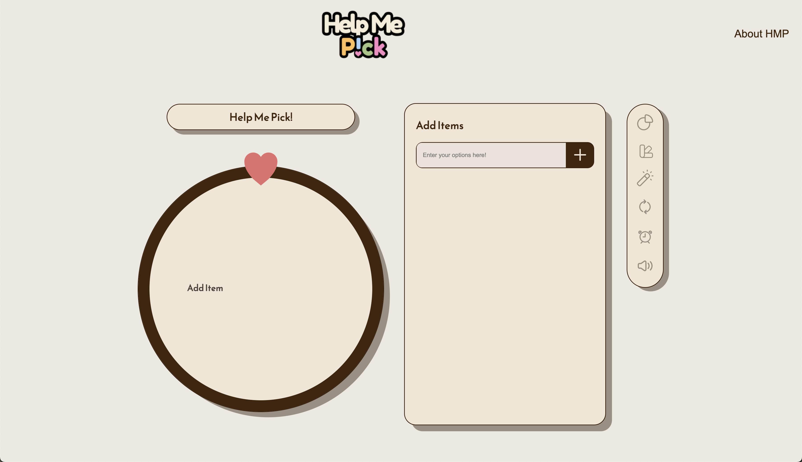
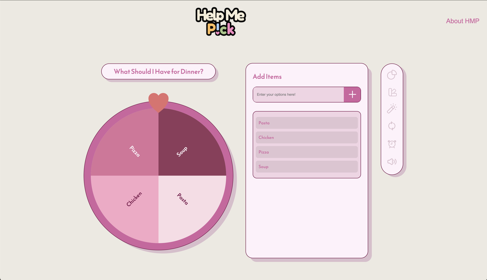

# Help Me Pick! 🌀
<p align="center">
  
</p>

**Help Me Pick!** is an interactive decision-making tool that simplifies choices with a touch of playfulness. Designed to streamline decision-making and eliminate the stress of indecision, it offers dynamic features and a highly customizable user experience.

---

## Why Help Me Pick?

Modern life is full of choices—and the stress of making decisions can lead to **analysis paralysis**. Whether you're picking your next meal, deciding on a movie, or brainstorming product features, **Help Me Pick!** makes decision-making effortless and fun.

---

### Try it! 🌟
[https://help-me-pick.vercel.app/](https://help-me-pick.vercel.app/)

## Preview ✨
<div>
    
    
</div>


## How It Works 📚

1. Add a list of options tailored to your decision-making needs.
2. Select one of the decision modes:
   - **Spin the Wheel** for a random result.
   - **Weighted Choices** to favor certain outcomes.
   - **Elimination Mode** for a process of elimination.
3. Let **Help Me Pick!** provide a fun and interactive decision-making experience.

---

## Real-World Use Cases 🎉

- **Team Collaboration:** Decide on meeting topics or project directions.
- **Daily Life:** Pick meals, movies, or outfits.
- **Creative Brainstorming:** Narrow down ideas in a fun way.

---

## Features 🚀

### 🎯 Smart Decision Modes
- **Spin the Wheel**: Randomized selection with visual flair.
- **Weighted Choices**: Tailor outcomes with customizable probabilities.
- **Elimination Mode**: Gradual narrowing for indecisive moments.

### ✍️ Personalization
- Fully customizable option lists for any scenario.

### 🌟 Intuitive User Interface
- Clean, responsive design optimized for desktop and mobile devices.
- Engaging animations for a fun user experience.

### 🛠️ Built with Scalability in Mind
- **Frontend:** JavaScript + React for dynamic interactivity.
- **Backend:** Node.js and Express for efficient API handling.

---

## Technology Stack 💻

| **Stack Component**    | **Technology Used**                    | **Description**                                                                                     |
|-------------------------|----------------------------------------|-----------------------------------------------------------------------------------------------------|
| **Frontend**           | React, JavaScript, CSS Modules         | Handles core UI, dynamic interactivity, and styling. Scoped CSS Modules ensure modular and reusable styles. |
| **State Management**   | React Hooks, Context API               | `useState` and `useEffect` manage component states, while Context API provides global theming support. |
| **Theming**            | Custom Theme Provider, CSS Variables   | Dynamically updates colors and styles based on user-selected themes using `ThemeContext` and CSS variables. |
| **Animations**         | CSS Transitions, SVG Manipulation      | Smooth animations for spinning effects using CSS transitions and dynamic SVG rendering for spinner segments. |
| **SVG Rendering**      | React JSX, Dynamic SVG Paths           | Spinner and segments are rendered using `<svg>` elements, with precise path calculations for smooth visuals. |
| **Utilities**          | Custom Functions (e.g., Color Utils)   | Includes helper functions for randomization, color contrast adjustments, and font color calculations. |
| **Backend** (Optional) | None (Frontend-only)                   | Currently, the app is fully frontend-driven, with no server-side components or persistent data storage. |


## Installation 🛠️

1. Clone the repository:
   ```bash
   git clone https://github.com/svnsvnsvn/help-me-pick.git
   cd help-me-pick
   ```

2. Install dependencies:
   ```bash
   npm install
   ```

3. Start the development server:
   ```bash
   npm start
   ```

4. Access the app at `http://localhost:3000`.

---

### 🛠️ Built with Scalability in Mind
- **Frontend:** JavaScript + React for dynamic interactivity.
- **Backend (Planned):** Node.js and Express for future API handling.

## Future Roadmap 🛤️

- **Dark Mode Support** 🌙.
- **Integration with AI:** Suggest weighted options based on previous decisions.
- **Social Features:** Share decisions with friends or teams in real-time.
- **Advanced Analytics:** Track decision trends and improve personalization.
